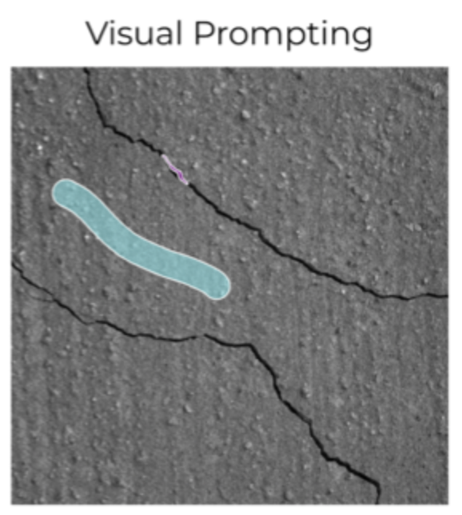
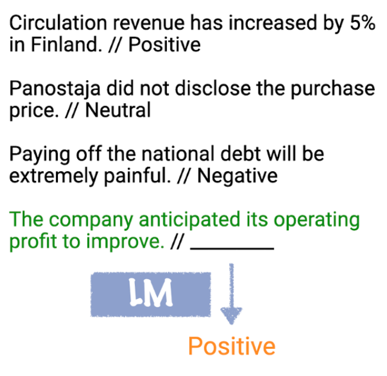
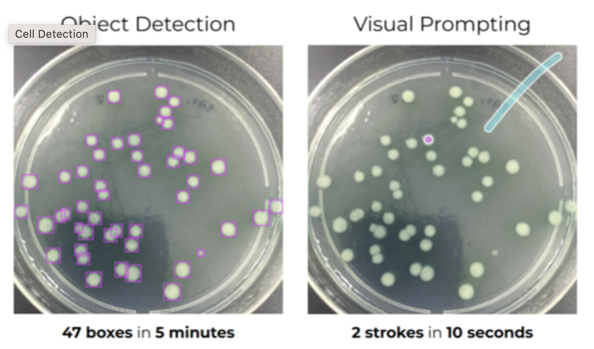
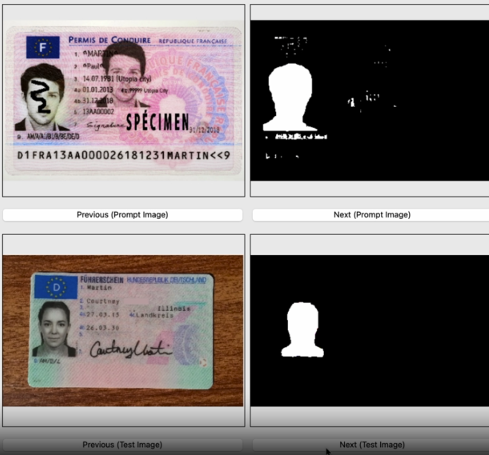

# Visual prompting

## What is visual prompting?
Visual prompting is an approach that takes text prompting (such as writing a prompt in ChatGPT) to computer vision. A visual prompt is a simple visual specification of a vision task.

Imagine, for example, that you would like to specify the task of detecting wall cracks (and then train a model that can detected cracks on walls). Instead of writing a text prompt (like "cracks on a wall; fissures; fractures in the surface; crevices in the plaster; splits; breaks on the structure"), you would draw a few strokes on an image to denominate the crack and the background, like in the image below:

<figure>
  
  <figcaption>This visual prompt specifies the task of crack detection by specifying part of the crack (pink stroke) and part of the background (light-blue stroke).</figcaption>
</figure>

## Promptable models and in-context learning
In-context learning describes the idea that an ML model can learn a new task simply from the context provided within a given interaction session, rather than acquiring knowledge from a separate training process. Imagine a chat session with GPT-4, for example, where as part of your input prompt you specify a task like the one below in three examples (input-output pairs):

<figure>
  
  <figcaption>Example of in-context learning.</figcaption>
</figure>

Based on the examples provided in the prompt, the model learns to perform a new task like sentiment classification.

In visual prompting, the idea is to achieve something similar in the visual domain. The prompts are provided as visual signals rather than text and the model needs to be able to process a vision prompt and be flexible enough to perform various vision tasks based on the provided prompt.

## How is it relevant to Applied Computer Vision?
Visual prompting has the potential to significantly shorten and automate part of the work of Computer Vision practicioners. The promise is that with only a few strokes, one can transform an unlabelled dataset into a deployed model in a matter of minutes.

The way that Landing AI and others advertise this, is by contrasting the old "traditional workflow" with a new "prompt-based work flow":
- traditional workflow: Collect training data → Collect labels → Train model → Predict
- prompt-based workflow: Prompt → Predict

Imagine that we need to build a hologram detector for document images. According to the traditional workflow, we would first need to collect training data and labels, then train a model, to finally predict and run inference. Overall, a process that can take several weeks. In contrast, in the prompt-based workflow, we would simply use a visual prompt by specifying holograms and backgrounds with one stroke each in a couple of images. This prompt could then be generalised with a promptable model (think for example key point prediction with SegGPT), which could then be used for prediction/inference immediately.

The contrast between the old and the new workflow is also highlighted in the figure below:
<figure>
  
  <figcaption>In the old workflow (left), collecting data and labels is time-consuming. In the new workflow (right), the task is specified in a matter of seconds.</figcaption>
</figure>

## Advantages of visual prompts
As an alternative to visual prompting, it is also possible to use text prompts in combination with CLIP embeddings. In a classification setting, together with image similarity search, this offers a splendid strategy for collecting data in an automatic fashion. However, there are a few limitations to this approach:

1. For specialised images (for example, images of LCD display defects, cell cultures or tree cover) it might be easier and more natural to describe a task with a visual prompt rather than trying to use the English vocabulary
2. For tasks beyond classification, such as object detection and semantic segmentation a visual prompt will more naturally communicate the intent

## How to get started with visual prompting.
The authors of the [SegGPT: Segmenting Everything In Context](https://arxiv.org/abs/2304.03284) paper have built a [demo on their huggingface space](https://huggingface.co/spaces/BAAI/SegGPT) that allows you to experiment with visual prompting on your own data. 

If you would like to try visual prompting but your data is proprietary or PII data, I provide a repository and basic GUI for experimenting with visual prompting based on SAM and segGPT [here](https://github.com/MSchnei/visprompt).
<figure>
  
  <figcaption>Basic GUI to experiment with visual prompting on your own data based on this [repo](https://github.com/MSchnei/visprompt).</figcaption>
</figure>